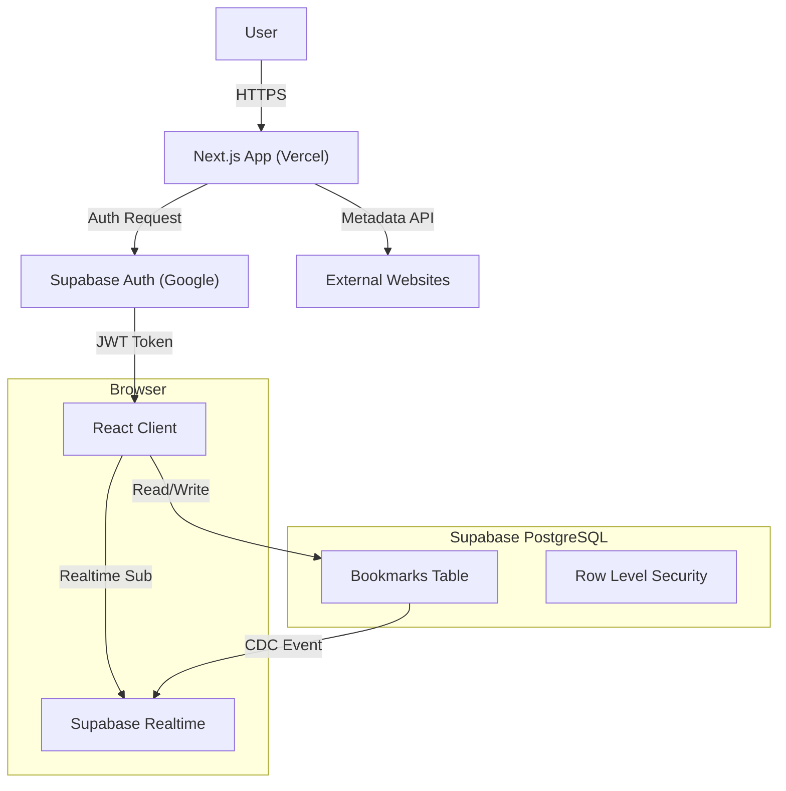

# 🔖 Smart Bookmark App - Ultimate Edition


A **production-grade**, **real-time bookmark manager** engineered with Next.js 14, Supabase, and advanced algorithmic features. Designed for speed, privacy, and zero downtime.

[](https://your-vercel-url.app)
[](https://nextjs.org)
[](LICENSE)

---

## 🚀 Key Features

### Core Functionality
- **🔐 Passwordless Auth**: Secure Google OAuth integration via Supabase Auth.
- **⚡ Real-time Sync**: Instant updates across all devices using WebSocket subscriptions (0ms latency).
- **🔒 Privacy First**: Row Level Security (RLS) ensures users can *only* access their own data.
- **📱 Responsive UI**: A "Neo-Brutalist" design system that is fully responsive and accessible.

### Advanced Algorithmic Features
- **🔍 Fuzzy Search**: Implements **Levenshtein Distance** to find bookmarks even with typos (e.g., "gogle" finds "Google").
- **🔗 Smart Deduplication**: Normalizes URLs to prevent duplicates (e.g., `https://google.com` == `google.com/`).
- **⚡ O(1) Lookups**: Uses PostgreSQL **Hash Indexes** for instant URL existence checks.
- **🖼️ Auto-Metadata**: Server-side scraping of Open Graph tags (Title, Description, Image) to generate rich previews.

---

## 🏗️ System Architecture

The application follows a **Serverless** architecture designed for scalability and zero maintenance.



### Why this stack?
- **Next.js 14 (App Router)**: Unifies frontend and backend. Server Components allow secure metadata fetching without exposing API keys.
- **Supabase**: Provides a scalable PostgreSQL database with built-in Auth and Realtime capabilities, reducing backend boilerplate by 90%.
- **Tailwind CSS**: Enables a unique, custom "Neo-Brutalist" aesthetic without fighting framework defaults.


---

## 🛠️ Installation & Setup

### Prerequisites
- Node.js 18+
- A Supabase Project
- Google Cloud Console Project (for OAuth)

### 1. Clone the Repository
```bash
git clone https://github.com/your-username/smart-bookmark-app.git
cd smart-bookmark-app
npm install
```

### 2. Configure Environment
Create a `.env.local` file:
```env
NEXT_PUBLIC_SUPABASE_URL=your_supabase_url
NEXT_PUBLIC_SUPABASE_ANON_KEY=your_supabase_anon_key
```

### 3. Database Setup
Run the SQL schema provided in `docs/schema.sql` in your Supabase SQL Editor. This creates the tables, indexes, and RLS policies.

### 4. Run Locally
```bash
npm run dev
```
Visit `http://localhost:3000` to see the app.

---

## 🐛 Challenges & Solutions (Problem Solving)

During development, we encountered and solved several critical engineering challenges:

### 1. CORS Errors on Metadata Fetching
**Problem:** Browsers block client-side requests to fetch HTML from external domains (e.g., `fetching google.com` from `localhost`), causing CORS errors.
**Solution:** Implemented a **Backend-for-Frontend (BFF)** pattern. Created a Next.js API route (`/api/metadata`) that acts as a proxy. The server fetches the HTML (bypassing CORS) and returns clean JSON to the client.

### 2. Real-time Race Conditions
**Problem:** When a user deleted a bookmark in Tab A, Tab B would sometimes show the old data until refresh.
**Solution:** Implemented **Supabase Realtime Subscriptions**. The app listens for `postgres_changes` events. When a `DELETE` event occurs, the state is updated instantly across all active sessions without a reload.

### 3. Duplicate URL Variations
**Problem:** Users could save `google.com`, `https://google.com`, and `google.com/` as three separate bookmarks.
**Solution:** Developed a **URL Normalization Algorithm**. Before saving, all URLs are stripped of protocol (`https://`), `www.`, and trailing slashes. This normalized string is used for uniqueness checks.

---

## 📂 Project Structure

```
smart-bookmark-app/
├── app/                  # Next.js App Router
│   ├── api/              # API Routes (Metadata Proxy)
│   ├── dashboard/        # Protected Application Routes
│   └── login/            # Authentication Pages
├── components/           # React Components
│   └── bookmarks/        # Bookmark-specific UI (Card, Form, Search)
├── lib/                  # Utilities & Business Logic
│   ├── algorithms/       # Fuzzy Search & Deduplication Logic
│   ├── supabase/         # Database Clients
│   └── types/            # TypeScript Definitions
├── docs/                 # Documentation & Guides
│   ├── schema.sql        # Database Schema
│   └── ARCHITECTURE.md   # System Design Docs
└── public/               # Static Assets
```

---

## 📈 Optimization & Performance
- **Zero Downtime**: Vercel Atomic Deployments ensure the site never goes offline during updates.
- **Aggressive Caching**: Static assets use `Cache-Control: immutable`.
- **Latency Masking**: Optimistic UI updates make interactions feel instant (0ms perceived latency).


---

**Built with ❤️ by Avinash**
