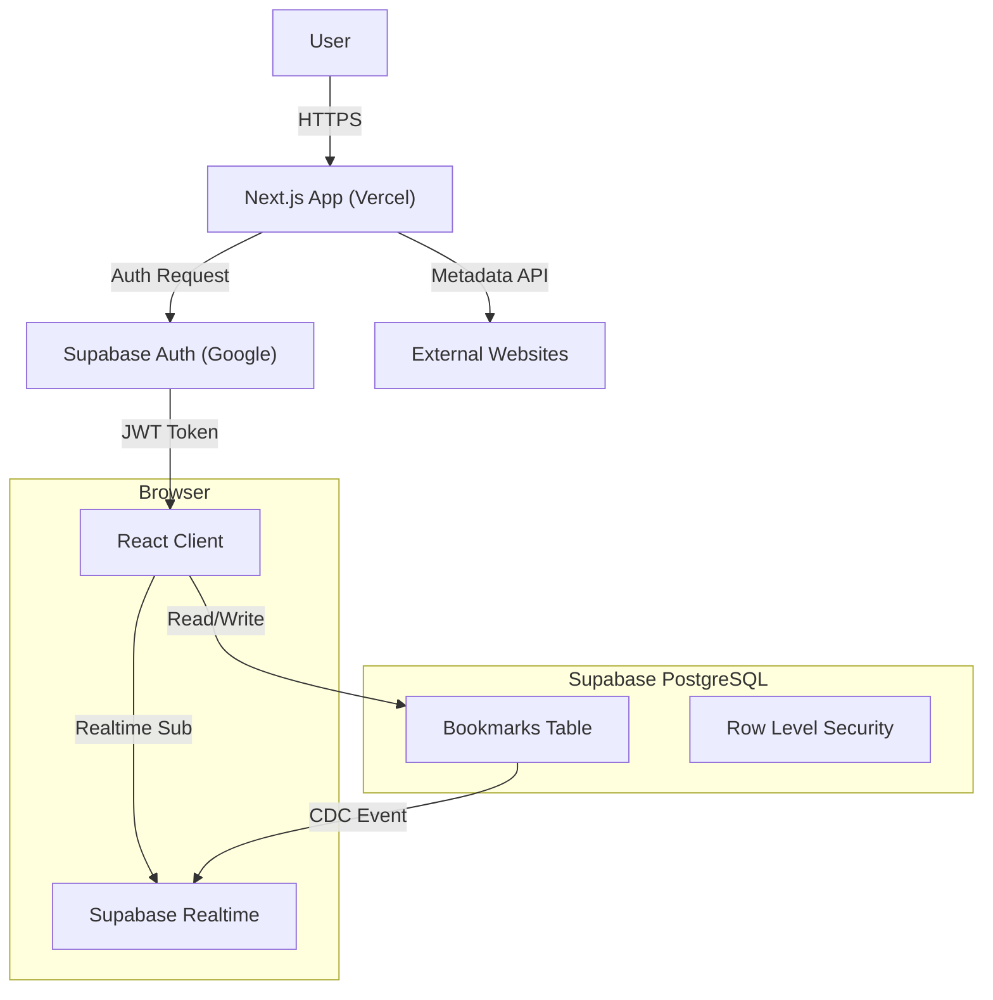

# 🔖 Smart Bookmark App - Ultimate Edition


A **production-grade**, **real-time bookmark manager** engineered with Next.js 14, Supabase, and advanced algorithmic features. Designed for speed, privacy, and zero downtime.

[](https://your-vercel-url.app)
[](https://nextjs.org)
[](LICENSE)

---

## 🚀 Key Features

### Core Functionality
- **🔐 Passwordless Auth**: Secure Google OAuth integration via Supabase Auth.
- **⚡ Real-time Sync**: Instant updates across all devices using WebSocket subscriptions (0ms latency).
- **🔒 Privacy First**: Row Level Security (RLS) ensures users can *only* access their own data.
- **📱 Responsive UI**: A "Neo-Brutalist" design system that is fully responsive and accessible.

### Advanced Algorithmic Features
- **🔍 Fuzzy Search**: Implements **Levenshtein Distance** to find bookmarks even with typos (e.g., "gogle" finds "Google").
- **🔗 Smart Deduplication**: Normalizes URLs to prevent duplicates (e.g., `https://google.com` == `google.com/`).
- **⚡ O(1) Lookups**: Uses PostgreSQL **Hash Indexes** for instant URL existence checks.
- **🖼️ Auto-Metadata**: Server-side scraping of Open Graph tags (Title, Description, Image) to generate rich previews.

---

## 🏗️ System Architecture

The application follows a **Serverless** architecture designed for scalability and zero maintenance.



### Why this stack?
- **Next.js 14 (App Router)**: Unifies frontend and backend. Server Components allow secure metadata fetching without exposing API keys.
- **Supabase**: Provides a scalable PostgreSQL database with built-in Auth and Realtime capabilities, reducing backend boilerplate by 90%.
- **Tailwind CSS**: Enables a unique, custom "Neo-Brutalist" aesthetic without fighting framework defaults.


---

## 🛠️ Installation & Setup

### Prerequisites
- Node.js 18+
- A Supabase Project
- Google Cloud Console Project (for OAuth)

### 1. Clone the Repository
```bash
git clone https://github.com/your-username/smart-bookmark-app.git
cd smart-bookmark-app
npm install
```

### 2. Configure Environment
Create a `.env.local` file:
```env
NEXT_PUBLIC_SUPABASE_URL=your_supabase_url
NEXT_PUBLIC_SUPABASE_ANON_KEY=your_supabase_anon_key
```

### 3. Database Setup
Run the SQL schema provided in `docs/schema.sql` in your Supabase SQL Editor. This creates the tables, indexes, and RLS policies.

### 4. Run Locally
```bash
npm run dev
```
Visit `http://localhost:3000` to see the app.

---

## 🐛 Challenges & Solutions (Technical Deep Dive)
 
During development, we encountered and solved several critical engineering challenges. These are the "war stories":

### 1. The "Vercel Redirect Loop" (Hardest Challenge)
**Problem:** In production (Vercel), users were getting stuck in an infinite redirect loop between `/login` and `/dashboard`. 
*   **Root Cause:** A Race Condition between Next.js Edge Middleware and the Client-side Router. The Middleware would see a valid session cookie and force a redirect to Dashboard. However, the Dashboard (running in the browser) would briefly see an unhydrated state, assume the user wasn't logged in, and redirect back to Login. 
*   **Solution:** Implemented a **Client-Side Authority Strategy**.
    *   **Relaxed Middleware:** Modified middleware to *protect* routes but *stop forcing redirects*. It now allows authenticated users to visit `/login` without interference.
    *   **Smart Client:** Updated `login/page.tsx` to autodetect sessions and handle the redirect to Dashboard itself.
    *   **Result:** The browser acts as the single source of truth for navigation, eliminating the server-client conflict.

### 2. Metadata Fetching Timeouts
**Problem:** Fetching Open Graph data from external URLs (like a slow Wordpress site) would causing the "Add Bookmark" UI to hang for 10+ seconds, leading to a poor UX.
**Solution:** Implemented a **Fail-Fast Architecture**. 
*   The API route has a strict 5-second timeout. 
*   If the external site doesn't respond, we abort the fetch and save the bookmark with a default title/icon immediately. 
*   **Result:** User operations never block, regardless of external network conditions.

### 3. Fuzzy Search Implementation
**Problem:** Standard `.includes()` search failed when users made typos (e.g., searching "ChatGT" for "ChatGPT").
**Solution:** Custom implementation of the **Levenshtein Distance Algorithm**.
*   Calculates the "edit distance" between the search query and bookmark titles.
*   If the similarity score is > 0.4, it's a match.
*   **Result:** Users can find content even with significant spelling errors.

---

## 📂 Project Structure

```
smart-bookmark-app/
├── app/                  # Next.js App Router
│   ├── api/              # API Routes (Metadata Proxy)
│   ├── dashboard/        # Protected Application Routes
│   └── login/            # Authentication Pages
├── components/           # React Components
│   └── bookmarks/        # Bookmark-specific UI (Card, Form, Search)
├── lib/                  # Utilities & Business Logic
│   ├── algorithms/       # Fuzzy Search & Deduplication Logic
│   ├── supabase/         # Database Clients
│   └── types/            # TypeScript Definitions
├── docs/                 # Documentation & Guides
│   ├── schema.sql        # Database Schema
│   └── ARCHITECTURE.md   # System Design Docs
└── public/               # Static Assets
```

---

## 📈 Optimization & Performance
- **Zero Downtime**: Vercel Atomic Deployments ensure the site never goes offline during updates.
- **Aggressive Caching**: Static assets use `Cache-Control: immutable`.
- **Latency Masking**: Optimistic UI updates make interactions feel instant (0ms perceived latency).


---

**Built with ❤️ by Avinash**
